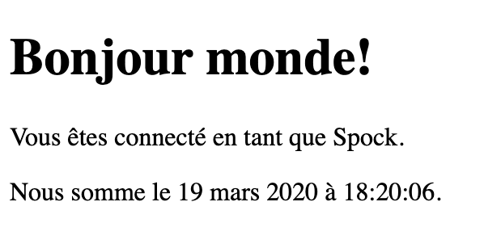
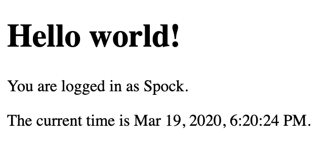

18n

This project contains tasks for learning to create internationalized web pages with Flask.

## Tasks To Complete

+ [x] 0. **Basic Flask app**<br/>[0-app.py](0-app.py) contains a Python script that sets up a basic Flask app with the following requirements:
  + Create a single `/` route and an [index.html](templates/0-index.html) template that simply outputs “Welcome to Holberton” as page title (`<title>`) and “Hello world” as header (`<h1>`).

+ [x] 1. **Basic Babel setup**
  + Copy [0-app.py](0-app.py) into [1-app.py](1-app.py) and [templates/0-index.html](templates/0-index.html) into [templates/1-index.html](templates/1-index.html).
  + Install the Babel Flask extension:
    ```powershell
    pip3 install flask_babel
    ```
  + Instantiate the `Babel` object in your app. Store it in a module-level variable named `babel`.
  + In order to configure available languages in our app, you will create a `Config` class that has a `LANGUAGES` class attribute equal to `["en", "fr"]`.
  + Use `Config` to set Babel’s default locale (`"en"`) and timezone (`"UTC"`).
  + Use that class as config for your Flask app.

+ [x] 2. **Get locale from request**
  + Copy [1-app.py](1-app.py) into [2-app.py](2-app.py) and [templates/1-index.html](templates/1-index.html) into [templates/2-index.html](templates/2-index.html).
  + Create a `get_locale` function with the `babel.localeselector` decorator. Use `request.accept_languages` to determine the best match with our supported languages.

+ [x] 3. **Parametrize templates**
  + Copy [2-app.py](2-app.py) into [3-app.py](3-app.py) and [templates/2-index.html](templates/2-index.html) into [templates/3-index.html](templates/3-index.html).
  + Use the `_` or `gettext` function to parametrize your templates. Use the message IDs `home_title` and `home_header`.
  + Create a `babel.cfg` file containing:
    ```yml
    [python: **.py]
    [jinja2: **/templates/**.html]
    extensions=jinja2.ext.autoescape,jinja2.ext.with_
    ```
  + Initialize your translations with:
    ```powershell
    ~/.local/bin/pybabel extract -F babel.cfg -o messages.pot .
    ```
  + Initialize your two dictionaries with:
    ```powershell
    ~/.local/bin/pybabel init -i messages.pot -d translations -l en
    ~/.local/bin/pybabel init -i messages.pot -d translations -l fr
    ```
  + Edit files `translations/[en|fr]/LC_MESSAGES/messages.po` to provide the correct value for each message ID for each language. Use the following translations:
    | **msgid** |	**English**	| **French** |
    |:-|:-|:-|
    | home_title | "Welcome to Holberton" | "Bienvenue chez Holberton" |
    | home_header	| "Hello world!" | "Bonjour monde!" |
  + Compile your dictionaries with:
    ```powershell
    ~/.local/bin/pybabel compile -d translations
    ```
  + Reload the home page of your app and make sure that the correct messages show up.

+ [x] 4. **Force locale with URL parameter**
  + In this task, you will implement a way to force a particular locale by passing the `locale=fr` parameter to your app’s URLs.
  + Copy [3-app.py](3-app.py) into [4-app.py](4-app.py) and [templates/3-index.html](templates/3-index.html) into [templates/4-index.html](templates/4-index.html).
  + In your `get_locale` function, detect if the incoming request contains `locale` argument and if its value is a supported locale, return it. If not or if the parameter is not present, resort to the previous default behavior.
  + You should be able to test different translations by visiting `http://127.0.0.1:5000?locale=[fr|en]`.
  + Visiting [`http://127.0.0.1:5000/?locale=fr`](http://127.0.0.1:5000/?locale=fr) should display this level 1 heading:<br/>
    

+ [x] 5. **Mock logging in**
  + Copy [4-app.py](4-app.py) into [5-app.py](5-app.py) and [templates/4-index.html](templates/4-index.html) into [templates/5-index.html](templates/5-index.html).
  + Creating a user login system is outside the scope of this project. To emulate a similar behavior, copy the following user table into [5-app.py](5-app.py).
    ```python
    users = {
        1: {"name": "Balou", "locale": "fr", "timezone": "Europe/Paris"},
        2: {"name": "Beyonce", "locale": "en", "timezone": "US/Central"},
        3: {"name": "Spock", "locale": "kg", "timezone": "Vulcan"},
        4: {"name": "Teletubby", "locale": None, "timezone": "Europe/London"},
    }
    ```
  + This will mock a database user table. Logging in will be mocked by passing `login_as` URL query parameter containing the user ID to log in as.
  + Define a `get_user` function that returns a user dictionary or `None` if the ID cannot be found or if `login_as` was not passed.
  + Define a `before_request` function and use the `app.before_request` decorator to make it be executed before all other functions. `before_request` should use `get_user` to find a user if any, and set it as a global on `flask.g.user`.
  + In your HTML template, if a user is logged in, in a paragraph tag, display a welcome message otherwise display a default message as shown in the table below.
    | **msgid** | **English** | **French** |
    |:-|:-|:-|
    | logged_in_as | "You are logged in as %(username)s." | "Vous êtes connecté en tant que %(username)s." |
    | not_logged_in | "You are not logged in." | "Vous n'êtes pas connecté." |
  + Visiting [http://127.0.0.1:5000/](http://127.0.0.1:5000/) in your browser should display this:<br/>
    
  + Visiting [http://127.0.0.1:5000/?login_as=2](http://127.0.0.1:5000/?login_as=2) in your browser should display this:<br/>
    

+ [x] 6. **Use user locale**
  + Copy [5-app.py](5-app.py) into [6-app.py](6-app.py) and [templates/5-index.html](templates/5-index.html) into [templates/6-index.html](templates/6-index.html).
  + Change your `get_locale` function to use a user’s preferred locale if it is supported.
  + The order of priority should be:
    1. Locale from URL parameters.
    2. Locale from user settings.
    3. Locale from request header.
    4. Default locale.
  + Test by logging in as different users.<br/>
    

+ [x] 7. **Infer appropriate time zone**
  + Copy [6-app.py](6-app.py) into [7-app.py](7-app.py) and [templates/6-index.html](templates/6-index.html) into [templates/7-index.html](templates/7-index.html).
  + Define a `get_timezone` function and use the `babel.timezoneselector` decorator.
  + The logic should be the same as `get_locale`:
    1. Find `timezone` parameter in URL query parameters.
    2. Find time zone from user settings.
    3. Default to UTC.
  + Before returning a URL-provided or user time zone, you must validate that it is a valid time zone. To that, use `pytz.timezone` and catch the `pytz.exceptions.UnknownTimeZoneError` exception.

+ [x] 8. **Display the current time**
  + Copy [7-app.py](7-app.py) into [app.py](app.py) and [templates/7-index.html](templates/7-index.html) into [templates/index.html](templates/index.html).
  + Based on the inferred time zone, display the current time on the home page in the default format. For example:
    `Jan 21, 2020, 5:55:39 AM` or `21 janv. 2020 à 05:56:28`.
  + Use the following translations:
    | **msgid** | **English** | **French** |
    |:-|:-|:-|
    | current_time_is | "The current time is %(current_time)s." | "Nous sommes le %(current_time)s." |
  + Displaying the time in French looks like this:<br/>
    
  + Displaying the time in English looks like this:<br/>
    
